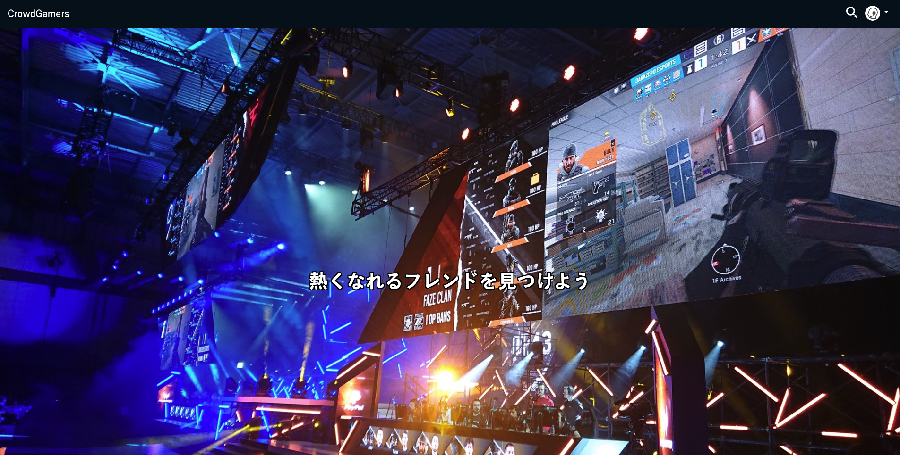
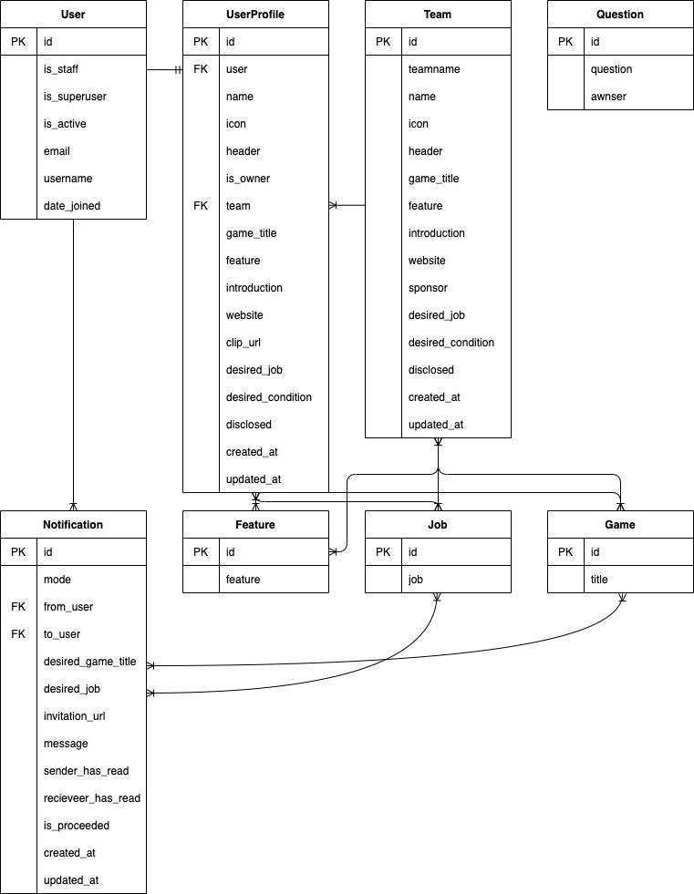

## 概要
『熱くなれるフレンドを見つけよう』  
CrowdGamers はチーム・メンバーを探すことができるサービスです。

## URL
[crowdgamers.com](http://crowdgamers.com/)  
Twitterログインでボタンひとつでログインすることができます。

## 作成の背景
私は趣味でよくゲームをしています。E-Sports シーンが盛り上がっていき自身がチームに所属して活動したり、チームを立ち上げて活動したいと思っている人が周りにたくさんいます。  

そういう人たちはTwitterやその他SNS経由で参加したり募集したりしますが、条件の記述だったり理想の人物像などの有無、チームによって違う観点で書かれているので比較がしづらいと感じています。実際にミスマッチなどが起きている話を聞きます。  

なので、同じフォーマットで比較できるように、また気軽にチームを探したい・メンバーを募集したい。そのようなことができるようにこのアプリケーションを作成することを決めました。

## ペルソナ
性別：　特になし  
年齢：　10代前半から30代後半  
移住地：　日本  
特徴：　ゲーム繋がりがあまりない人  

## 主な利用方法

### 「チームメンバーを探したい場合」

1. ユーザー登録
2. チームを登録
3. 気になるプレイヤーに招待を送る

### 「チームを探したい場合」

1. ユーザー登録
2. 気になるチームを探す
3. チームにリクエストを送る

### 基本機能一覧

* ユーザー機能(twitter認証)
* チーム機能
* ゲームタグ機能
* 特徴タグ機能
* 検索機能
* 通知機能
* チームリクエスト機能
* リクエスト認可機能
* ユーザー招待機能
* 招待認可機能
* メンバー追加機能
* メンバー追加認可機能

## 特に力を入れた点

### DRYを意識したコーディング

一度アプリケーションの設計を文字としてまとめ、それを参考にコーディングを進めていきました。しかし、コーディングを進めていく中で、まとめられる部分を発見しました。その部分を放置せず、再コーディングしコードを省略することができました。

### docstring を充実させる

自分で改修するとき、自分がどのような理由でそのコードを書いたかわかるように Numpy の docstring の書き方を参考にし docstring を書きました。

## 使用技術・環境
### 【フロントエンド】

* HTML5
* CSS (SCSS)
* JavaScript (jQuery)

### 【バックエンド】

* Python 3.8
* Django 3.1.5

### 【データベース】

* PostgreSQL 13.1

### 【開発環境】

* Docker, docker-compose
* Git

### 【本番環境】

* conoHa VPS
* Nginx, gunicorn

## ER図

## 今後行いたいこと

バックエンドを Django Rest Framework で書き直し、フロントを React を使用しロード時間短縮、UIなどの向上などに取り組みたいです。

## About me

16歳高校２年生で、プログラミングを学習中。普段は英語とプログラミングを学習しています。  
一社で一ヶ月インターン経験あります。  
twitter, note など様々なSNSで情報発信をしつつ、学習に励んでいます。  

* [twitter](https://twitter.com/haruu_iq/)  
* [note](https://note.com/haruu_iq/)  